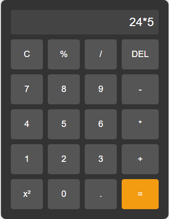

# Calculator App

A simple and user-friendly calculator app built with **HTML**, **CSS**, and **JavaScript**. It supports basic arithmetic operations, percentage calculations, and square calculations.



## Features

- **Basic Operations**: Addition (`+`), subtraction (`-`), multiplication (`*`), and division (`/`).
- **Percentage Calculation**: Calculate percentages with the `%` button.
- **Square Calculation**: Calculate the square of a number with the `x²` button.
- **Clear Display**: Clear the display with the `C` button.
- **Delete Last Character**: Remove the last character with the `DEL` button.
- **Responsive Design**: Works on both desktop and mobile devices.

## How to Use

1. **Basic Calculations**:
   - Enter numbers using the number buttons (`0-9`).
   - Use the operation buttons (`+`, `-`, `*`, `/`) to perform calculations.
   - Press the `=` button to see the result.

2. **Percentage Calculation**:
   - Enter a number (e.g., `50`).
   - Click the `%` button to calculate its percentage (e.g., `50%` becomes `0.5`).

3. **Square Calculation**:
   - Enter a number (e.g., `5`).
   - Click the `x²` button to calculate its square (e.g., `5²` becomes `25`).

4. **Clear Display**:
   - Click the `C` button to clear the display.

5. **Delete Last Character**:
   - Click the `DEL` button to remove the last character from the display.

## Setup Instructions

1. **Clone the Repository**:
   ```sh
   git clone https://github.com/ogbuman/calculator-app.git
   cd calculator-app
   ```
2. **Run the App**:
   - Open the `index.html` file in your web browser.
   - The calculator app will load and be ready to use.

3. **Customize**:
   - Modify `styles.css` to change the appearance.
   - Add new features or operations in `script.js`.

## Code Structure

- **`index.html`**: Contains the structure of the calculator (buttons, display, etc.).
- **`styles.css`**: Defines the styling and layout.
- **`script.js`**: Handles the logic for calculations and button interactions.

## Screenshots


## Technologies Used

- **HTML**: Structure of the app.
- **CSS**: Styling and responsiveness.
- **JavaScript**: Functionality and calculations.

## Contributing

If you'd like to contribute:

1. Fork the repository.
2. Create a new branch for your feature or bug fix.
3. Submit a pull request.

## License

This project is open-source and available under the [MIT License](LICENSE).

## Contact

For questions or suggestions:

- **Email**: [ogbuman@gmail.com](mailto:ogbuman@gmail.com)
- **GitHub**: [ogbuman](https://github.com/ogbuman)

Enjoy using the calculator app! 😊
